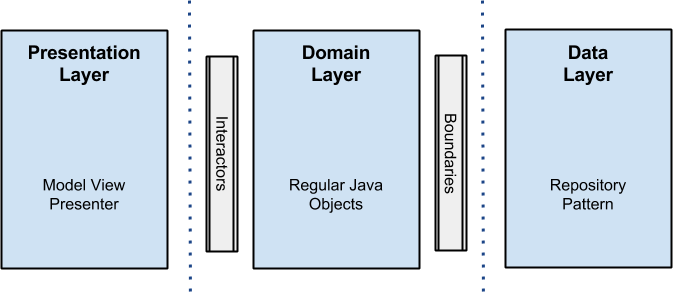
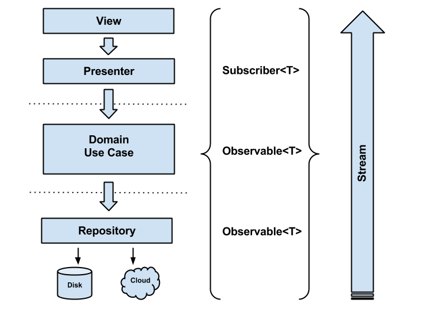

# Architecture Guidelines

A arquitetura de nossa aplicação Android é baseado no [MVP](https://en.wikipedia.org/wiki/Model%E2%80%93view%E2%80%93presenter) (Model View Presenter) pattern.

## Architectural approach


* __Presentantion Layer__:
	- __Presenter__: Controlam as requisições solicitadas pela View e determinam qual `UseCase` executará a ação. Também controla qual método da view será acionado de acordo com o retorno do `UseCase`.

	- __View__:  Componentes padrão do Android que implementam métodos que a presenter podem chamar. Eles também controlam as interações do usuários como click do usuário, chamando os métodos correspondentes da presenter.
	
* __Domain Layer__:
	- __Domain Use Case__: Representa as regras de negócios, acionados pela presenter via subscribe para gravar e/ou recuperar/listar os dados com Observables do RxJava.
	
* __Data Layer__:
	- __Repository__: É reponsável por salvar, recuperar/listar dados de um banco de dados local ou banco na nuvem (Firebase). Também pode representar o consumo de uma API Restful.

## Architectural reactive approach



* __View__: A view representa uma Activity, fragment ou ViewGroup que interage diretamente com o Presenter através de ações do usuários tais como click listeners, exibindo informações corretas para usuário dependendo da execução do método da Presenter. A View permanece o mais "burra" possível, conhecendo apenas componentes de View e o Presenter.

* __Presenter__: É de responsabilidade do Presenter o controle do ciclo de vida das assinaturas(Subscrivbe) e processar os dados para chamada correta dos métodos da view. O Presenter não conhece componentes específicos do Android, como por exemplo o Context.

* __Domain Use Case__: Representam as regras de negócios. Cada regra de negócio é um UseCase que retorna um Observable para o Subscribe realizado na Presenter. O UseCase executa o método do Repository que retornará os dados corretos.

* __Repository__: Retorna um Observable com os dados de banco/api para o respectivo UseCase que realizou a chamada. Existe um Repository para cada contexto, ou seja, podemos ter um Repository para User e outro para Colaborador.

# License

```
Copyright 2015 Ribot Ltd.

Licensed under the Apache License, Version 2.0 (the "License");
you may not use this file except in compliance with the License.
You may obtain a copy of the License at

    http://www.apache.org/licenses/LICENSE-2.0

Unless required by applicable law or agreed to in writing, software
distributed under the License is distributed on an "AS IS" BASIS,
WITHOUT WARRANTIES OR CONDITIONS OF ANY KIND, either express or implied.
See the License for the specific language governing permissions and
limitations under the License.
```
